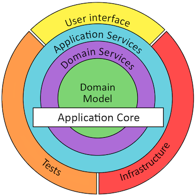

# Onion billing service

The purpose of this spring-boot service is to use it highlight two things: 

1. Service architecture: Onion architecture
2. Unit test concept
   
The service itself is just a simple CRUD application without a clean API and implementation.

# Service architecture: Onion architecture
Services start small and tend to get big.

Goal: Flexible and sustainable and portable architecture.

### Why Onion instead of Clean or Ports&Adapters

Ports&Adapters requires a layer to only depend on the next layer. This enforces mappings from bottom to the top and 
it is not necessary in every case. A developer could decide to expose the domain model via the REST API.

Clean Architecture is also ok with it's dependency rule. It allows even more layers and encourages a screaming 
architecture. I didn't see it in action yet but it sounds also promising.

Onion architecture:

### Arch Unit Onion

The Arch Unit library brings a preconfigured test for onion architecture. See ArchitectureTest.

# Unit test concept

A big improvement of development speed is to have a look at Robert C Martin's test contra variance blog post.

https://blog.cleancoder.com/uncle-bob/2017/10/03/TestContravariance.html

The proposed method to unit test is implemented in this service. Some would call it integration test but it all fits

together with the testing pyramid to call it unit test. See BillingServiceAndPersistenceTest.

Main take away: The smallest unit to test is not a class. Testing every class means that the tests are coupled to the 
implementation.

Unit tests testing the complete service as a first user of the service.

# Online references and resources
Create spring template: https://start.spring.io/

API documentation: https://www.baeldung.com/swagger-2-documentation-for-spring-rest-api

Ports and adapters architecture test: https://www.archunit.org/userguide/html/000_Index.html#_architectures

Unit testing: https://www.youtube.com/watch?v=EZ05e7EMOLM&feature=youtu.be

Mapping: https://mapstruct.org/

REST Error handling: https://spring.io/guides/tutorials/rest/
Alternative: https://www.dariawan.com/tutorials/spring/spring-boot-restful-web-services-crud-example/

DDD Architekturen im Vergleich https://www.maibornwolff.de/know-how/ddd-architekturen-im-vergleich/